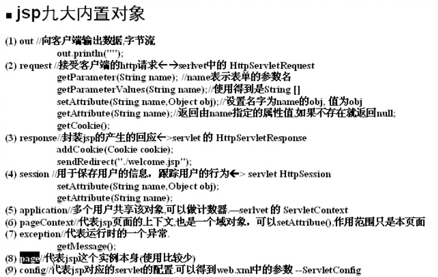
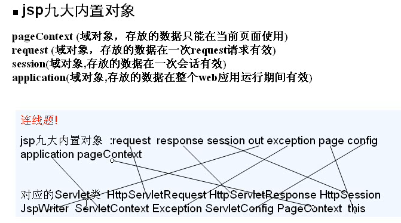

# JSP九大内置对象及四个作用域详解

## JSP九大内置对象:
  request、response、out、session、application、pageContext、page、config、exception

---
- 内置对象（又叫隐含对象)，就是在jsp中，不需要创建（由服务器<容器>来创建），可以直接使用的对象。

对象名 | 对象名称【中文】 | 对应类型 | 作用域
---- | --- | --- | --- 
request      |       请求对象　         |      javax.servlet.ServletRequest     |      Request
response      |      响应对象          |       javax.servlet.SrvletResponse      |       Page
pageContext    |     页面上下文对象     |      javax.servlet.jsp.PageContext     |     Page
session        |     会话对象           |      javax.servlet.http.HttpSession   |      Session
application    |     应用程序对象       |      javax.servlet.ServletContext      |    Application
out           |      输出对象         |        javax.servlet.jsp.JspWriter      |     Page
config       |       配置对象         |        javax.servlet.ServletConfig      |     Page
page          |      页面对象         |        javax.lang.Object                 |    Page
exception     |      例外对象        |         javax.lang.Throwable              |    page

---

page 当前页面有效时间最短（页面执行期）
request HTTP请求开始到结束这段时间
session HTTP会话开始到结束这段时间
application 服务器启动到停止这段时间

  out:所属类JspWriter
  request:实现了HttpServletRequest接口（此接口继承于ServletRequest接口）
  response:实现了HttpServletResponse接口(此接口继承于ServletResponse接口)
  session:实现了HttpSession接口
  application对象实现的接口ServletContext 

- JSP九大内置对象简述

- JSP九大内置对象对应Servlet

### 1.out对象：向客户端输出信息

主要有两个方法，print和println，后者不能实现换行  

 举例：输出一段粗体文字

  out.print("<b>这是一段粗体文字</b>");

 我们可以用out.print向客户端输出任何信息，比如说输出一个表格，等等。
 在网页上使用System.out.println(),信息输出到控制台上。

### 2.request对象：获取客户端传递到服务器的信息。
                     

- request常用方法举例

  (1)getParameter
     获取客户端传递给服务器的一个参数的值
  (2)getParameterNames
     获取客户端传递给服务器的所有参数的名字
  (3)getParameterValues
     获取一个参数的所有值(比如checkbox的情况)
 
  (4)setAttribute
  (5)getAttribute            attribute=属性
  (6)removeAttribute
  主要用在struts框架中

  必须在同一次请求中设置的属性，才能获取到
   (7)getAttributeNames

  (8)getCookies，讲Cookie的时候单独讲
    cookie 小甜饼，把个人信息存放在客户端的一门技术

  (9)getCharacterEncoding
 
  (10)getContentLength

  (11)getMethod

  (12)getRequestURL

  (13)getRemoteAddr

  (14)getServerName

  (13)getServerPort

  (14)getServletPath

  (15)getContextPath

 （16）getHeader,getHeaders,getHeaderNames
    
    Header：网页头，网页控制信息
   
   request.getHeader("Referer") 来自的网页

### 3.response对象: 向客户端浏览器输出信息，对客户的请求做成响应
 
### 4.session: 会话失效时间 ，tomcat中默认是30分钟，可以设置。 每个用户的会话空间是隔离的。

### 5.application 应用对象
  
  application,session,request：都可以通过setAttribute来设置属性，用getAttribute来获取属性，但是可见范围不一样。
  application对象所设置的属性，所有会话可见，而session对象设置的属性，只有在同一个session中可见。
  同样，前面讲过的request,它所设置的属性，只有在同一次请求之间可见。

 application 不会过期，在整个服务器运行期间都有效，服务器重启后丢失。

  application的其他一些方法：
  
  application.getRealPath()

### 6.page对象
  
  JSP网页本身，page对象是当前页面转换后的Servlet类的实例。从转换后的Servlet类的代码中，可以看到这种关系：Object page = this;在JSP页面中，很少使用page对象。
  
### 7.config对象:主要作用是取得服务器的配置信息。
  常用的方法有getInitParameter和getInitParameterNames，以获得Servlet初始化时的参数。

  通过 pageConext对象的 getServletConfig() 方法可以获取一个config对象。当一个Servlet 初始化时，容器把某些信息通过 config对象传递给这个 Servlet。 开发者可以在web.xml 文件中为应用程序环境中的Servlet程序和JSP页面提供初始化参数。

### 8.exception对象
   在可能产生错误的文件中用page指令指定errorpage
   在所指定的errorpage中，设置isErrorPage="true"这个page指令，然后用exception对象获取错误信息。
  <%@page errorPage="error.jsp"%>  

  session也是需要在页面上设置page指令的。

### 9.pageContext对象

  作用：a.可以用它获取其他八大内置对象的句柄（本身的句柄不用获取）

  out
  pageContext.getOut()
  request
  pageContext.getRequest();
  response
  pageContext.getResponse();
  session
  pageContext.getSession();
  application
  pageContext.getServletContext();
  config
  pageContext.getServletConfig();
  exception
  pageContext.getException();
  page
  pageContext.getPage();

  b.可以用它设置或者获取4个不同范围(page,request,session,application)内的变量的值

  设置的值只能在本页面内有效
  pageContext.setAttribute ("name" , "John") ;

  设置的值在同一个request请求中有效。   
  pageContext.setAttribute（"name" , "John", PageContext.REQUEST_SCOPE)）
  相当于request.setAttribute("name" , "John");

  设置的值在同一个session请求中有效。   
  pageContext.setAttribute（"name" , "John", PageContext.SESSION_SCOPE)）
  相当于session.setAttribute("name" , "John");

  设置的值在整个应用中有效。   
  pageContext.setAttribute（"name" , "John", PageContext.APPLICATION_SCOPE)）
  相当于application.setAttribute("name" , "John");